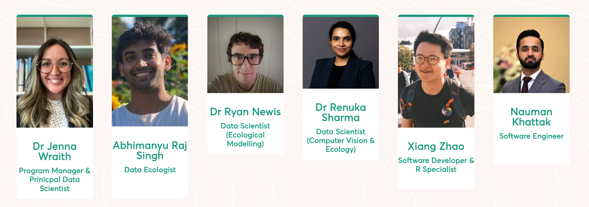

## Our team

### **Dr Jenna Wraith**

***(she/her)***

**Head of Sustainable Futures, Program Manager, Principal Data Scientist**

Jenna is a Conservation Scientist specialising in ecological modelling, species distribution modelling and using biodiversity data to inform policy. As an Adjunct Research Fellow at the Australian Rivers Institute, she uses spatial analyses and conservation planning to drive environmental strategies. Her work bridges science and technology, advancing biodiversity conservation and ecological research. In her free time, you can find Jenna growing food and flowers in the garden, hiking or getting crafty.

### **Abhimanyu Raj Singh**

***(he/him)***

**Data Ecologist**

Abhimanyu is a Zoologist who metamorphosed into an Environmental Scientist focused on terrestrial ecology and species behaviour/interactions. His MS majors are in environmental protection as well as climate change adaptation. He was an Environmental Field Officer in Sydney Basin, working with local councils and national parks on threatened and invasive species management. As a Functional Analyst, he facilitates platform testing strategies, provides user support, and assists with ecological and climate change modelling-based use cases/learning material/workshops for the EcoCommons platform.

### **Dr Ryan Newis**

***(he/him)***

**Data Scientist (Ecological Modelling)**

Ryan joined QCIF in 2024 as a Software Developer and R Specialist, with a focus on developing an ‘Integrated Ecological Data Service’ for State of Environment reporting in Queensland and working on the EcoCommons platform. His research background encompasses various aspects of the environmental sciences including landscape ecology, ecological network analysis, chemical ecology and pollination biology and ecology. His PhD studies focused on critical but unexplored aspects of stingless bee foraging ecology and colony propagation. When not entrenched in scientific exploration, you can find Ryan in the mountains somewhere searching for secret waterfalls and adding to his birding list.

### **Dr Renuka Sharma**

***(she/her)***

**Data Scientist (Computer Vision & Ecological Modelling)**

Renuka is a Data Scientist specializing in Computer Vision and Multi-modal Sensing, and she has worked on developing behavior recognition systems for animal welfare and elderly care. Her PhD in Computer Vision centered on anomaly detection in images and included an industrial collaboration with Woodside, where she designed a corrosion detection system. Over the years, Renuka has worked extensively with diverse datasets and is now eager to apply her expertise in Computer Vision to the field of Ecology through the EcoCommons projects. In her free time, Renuka enjoys reading and exploring nature through walks and hikes.

### **Xiang Zhao**

***(he/him)***

**Software Developer & R Specialist**

Xiang Zhao (Zhao) joined QCIF in 2024 as a Software Developer and R Specialist, focusing on maintaining and developing ecological algorithms for the EcoCommons Platform. During his MPhil at QUT, he utilized spatial mapping, modeling, statistics, and optimization algorithms to study historical biodiversity survey patterns in terrestrial Antarctica, proposing an optimal survey design for future research. At QUT, he also tutors in GIS and Environmental Planning units, leveraging his expertise in GIS and cartography.

Zhao spent two years traveling across Australia as a backpacker. Prior to this, he worked on a conservation project in Southwest China aimed at protecting giant panda habitats from the threat of free-ranging livestock. This project earned him the BirdLife International Young Conservation Leaders Award.

### **Nauman Khattak**

***(he/him)***

**Software Engineer**

Nauman Khattak is a Full Stack Software Developer at QCIF, contributing to the development of digital research infrastructure through his work on the EcoCommons project. His role involves designing and implementing scalable, user-friendly solutions that support environmental research and modelling.

With over seven years in the IT and software industry, he has developed web and mobile applications across sectors including hospitality, retail, healthcare, and telecommunications. His expertise spans backend and frontend development, system architecture, design, integration, and automation, with proficiency in PHP, Python, Java, JavaScript frameworks, and low-level languages such as Assembly, C, and C++. He also brings experience in mobile app development, and has worked with both relational and non-relational databases, alongside various cloud technologies.

Before joining QCIF, Nauman played key roles in startups and tech firms, where he developed intelligent systems, CRM platforms, and integrated infrastructure solutions. His background includes co-founding multiple products, working in multicultural teams, and driving innovation through agile methodologies and user-focused design.

At QCIF, Nauman brings a passion for automation, intelligent systems, and creating seamless user experiences to support environmental research outcomes.
