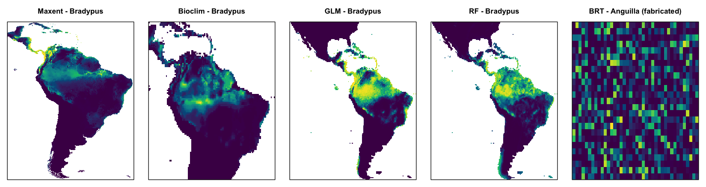
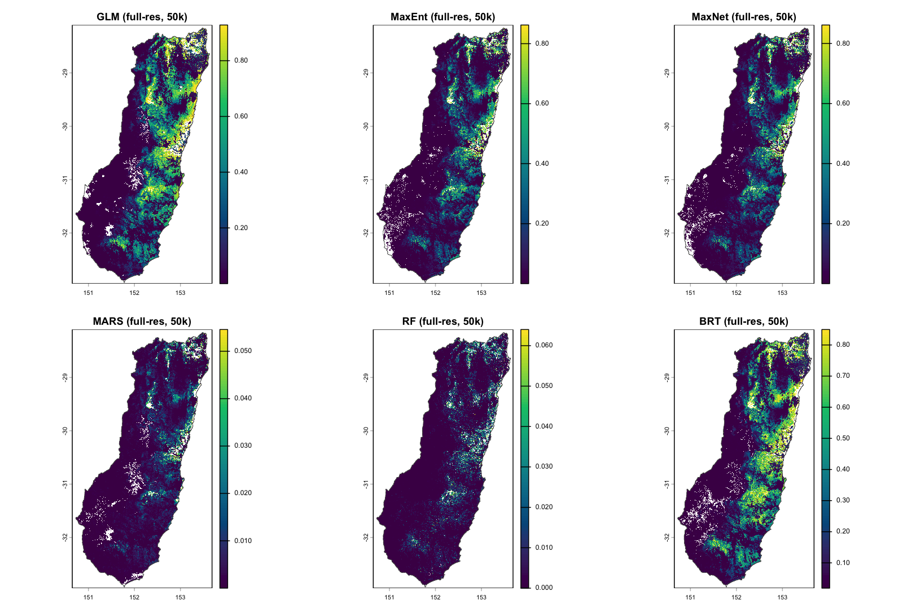
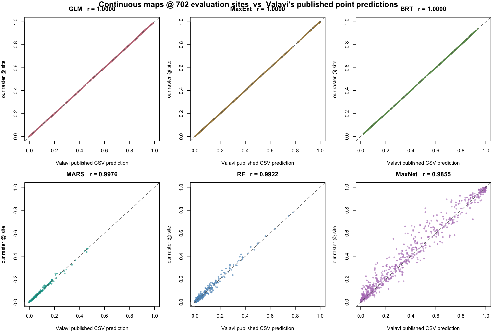
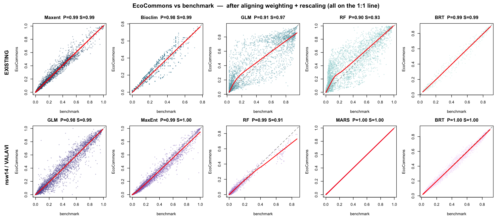

# Cross-validating EcoCommons SDM outputs against reference implementations (on development)

Author details: Xiang Zhao

Contact details: support\@ecocommons.org.au

Copyright statement: This script is the product of the EcoCommons platform. Please refer to the EcoCommons website for more details: https://www.ecocommons.org.au/

Date: July 2026

# Script information

This page documents the scientific-agreement unit tests that guard every species distribution
model (SDM) algorithm on the EcoCommons platform. Each test runs a real EcoCommons projection and
compares it against an independent reference implementation — the algorithm's own R package, or
Valavi et al. (2021)'s published benchmark on the NCEAS `nsw14` data.

Every SDM agreement test in the EcoCommons R package (`tests/testthat/test-sdm_projection_agreement.R`)
runs a real EcoCommons projection and compares it to a reference benchmark — the algorithm's own R
package, or Valavi et al. (2021)'s published benchmark on the NCEAS `nsw14` data.

## Overview — all 10 tests

**Existing tests** — benchmark is the *same engine* EcoCommons uses (reproducibility / self-consistency), asserted on **Pearson**.

| # | Algorithm | Species | EcoCommons engine | Benchmark | Metric | Threshold | Result |
|---|---|---|---|---|---|---|---|
| 1 | Maxent  | *Bradypus variegatus* | maxent.jar | maxent.jar `_avg` | Pearson | 0.90 | **0.987** ✓ |
| 2 | Bioclim | *Bradypus variegatus* | `dismo::bioclim` | dismo bioclim | Pearson | 0.90 | **0.980** ✓ |
| 3 | GLM     | *Bradypus variegatus* | biomod2 GLM | biomod2 GLM | Pearson | 0.99 | **1.000** ✓ |
| 4 | RF      | *Bradypus variegatus* | biomod2 RF | biomod2 RF | Pearson | 0.99 | **0.998** ✓ |
| 5 | BRT     | *Anguilla australis* | `dismo::gbm.step` (unit weights) | dismo gbm.step (unit weights) | Pearson | 0.95 | **0.985** ✓ |

**New nsw14 tests** — benchmark is Valavi et al. (2021)'s *independent* config (cross-implementation). After aligning weighting + rescaling, EcoCommons matches Valavi in **magnitude** for **all five**, so every one asserts **Pearson**.

| # | Algorithm | Species | EcoCommons engine | Valavi reference | Metric | Threshold | Result |
|---|---|---|---|---|---|---|---|
| 6 | GLM    | `nsw14` (NSW bird) | biomod2 GLM *(rescale off)* | `gam::step.Gam` | Pearson | 0.95 | **0.975** ✓ |
| 7 | MaxEnt | `nsw14` | maxent.jar | `dismo::maxent` | Pearson | 0.95 | **0.989** ✓ |
| 8 | RF     | `nsw14` | biomod2 RF *(rescale off)* | `randomForest` | Pearson | 0.95 | **0.986** ✓ |
| 9 | MARS   | `nsw14` | biomod2 `earth` *(rescale off)* | `earth` (glm=binomial, down-weighted) | Pearson | 0.95 | **1.000** ✓ |
| 10 | BRT   | `nsw14` | `dismo::gbm.step` *(test mocks down-weighting)* | gbm.step (down-weighted) | Pearson | 0.95 | **1.000** ✓ |

**All 10 pass — 0 failures.**

**Calibration alignment** — every EcoCommons↔reference gap turned out to be **weighting or rescaling, never the underlying learner**:

- **RF, GLM** — `rescale_all_models = false`: RF Pearson **0.89 → 0.99**, GLM **0.96 → 0.98**.
- **MARS** — biomod2 fits `earth(glm=binomial, weights=prevalence)`; the benchmark uses the same background down-weighting: **0.72 → 1.00**. (Earlier thought to be an unfixable wrapper difference — it was just the missing weights.)
- **BRT** — Valavi down-weights the background; EcoCommons **production uses unit weights** (down-weighting is *proposed, not applied*). The nsw14 BRT test **mocks** the internal weighting to down-weight — matching Valavi's config (Pearson **1.000**) — while the Anguilla BRT test keeps exercising the real unit-weight path (0.985).

Species: *Bradypus variegatus* (three-toed sloth, South America); *Anguilla australis*
(short-finned eel, NZ); `nsw14` (anonymised NSW diurnal bird, Valavi/NCEAS).

## Model configurations (nsw14 suite)

**Shared setup:** species `nsw14` (315 presences from `disPo` + background), 11 continuous NSW
predictors (`cti, disturb, mi, rainann, raindq, rugged, soildepth, soilfert, solrad, tempann,
topo`), `random_seed = 0`, deduplicated to one record per raster cell (8190 points).

| Algorithm | EcoCommons (test config) | Valavi reference (benchmark) |
|---|---|---|
| **GLM** | biomod2 GLM — `type=quadratic`, `test=AIC` (stepwise both directions), `family=binomial`, **`rescale_all_models=false`** | `glm` → `gam::step.Gam` — per-var scope {drop / linear / `poly(,2)`}, AIC both directions, background down-weighted, normalised |
| **MaxEnt** | maxent.jar — autofeature (L+Q+P+H), `betamultiplier=1`, `maximumiterations=500`, cloglog | `dismo::maxent` (maxent.jar) — `args="nothreshold"`, cloglog, not normalised |
| **RF** | biomod2 RF — classification, `ntree=500`, `mtry=default`, `nodesize=5`, **`rescale_all_models=false`** | `randomForest` — classification, `ntree=500`, `type="prob"` |
| **MARS** | biomod2 `earth` — `type=simple` (degree 1), `penalty=2`, `thresh=0.001`, `pmethod=backward`, `glm=binomial`, prevalence-weighted, **`rescale_all_models=false`** | `earth` — `degree=1`, `pmethod=backward`, `glm=binomial`, background down-weighted (matched to biomod2) |
| **BRT** | `dismo::gbm.step` — `tree.complexity=5`, `learning.rate=0.001`, `bag.fraction=0.75`, `n.folds=5`, `n.trees=50`, `max.trees=10000`, `family=bernoulli`, **unit weights (test mocks down-weighting)** | `dismo::gbm.step` — same hyper-parameters, background down-weighted, normalised |

*Bold = the calibration settings that were aligned. BRT uses Valavi's exact hyper-parameters; the
test mocks background down-weighting so it reproduces Valavi (`best.trees` 4350 = 4350) without
changing EcoCommons' shipped unit-weight default. GLM is the only algorithm that can't be
config-matched — biomod2 GLM and `gam::step.Gam` are different engines.*

*The **continuous suitability maps** further below use Valavi's **original Appendix S2** configs
(e.g. MARS = caret-tuned `earth`, `nprune` 2–20) — that's why they reproduce Valavi's published
CSV points, whereas the benchmarks here are tuned to match EcoCommons.*

### Benchmark references

| Benchmark | Method paper | Engine / tool |
|---|---|---|
| **GLM** | McCullagh & Nelder (1989); Hastie & Tibshirani (1990) `step.Gam` | biomod2 GLM (EC) / `gam::step.Gam` (Valavi) |
| **MaxEnt** | Phillips, Anderson & Schapire (2006); Phillips & Dudík (2008) | maxent.jar via `dismo` |
| **RF** | Breiman (2001) | `randomForest` |
| **MARS** | Friedman (1991) | `earth` |
| **BRT** | Elith, Leathwick & Hastie (2008) | `dismo::gbm.step` |
| **Bioclim** | Nix (1986); Booth et al. (2014) | `dismo::bioclim` |
| **Background down-weighting** | Elith et al. (2008); Valavi et al. (2021) | — |
| **nsw14 species + rasters (NCEAS)** | Elith et al. (2020) | `disdat` / OSF `kwc4v` |
| **Valavi reference configs** | Valavi et al. (2021) | Appendix S2 |
| **EcoCommons SDM platform** | Thuiller et al. (2009) `biomod2`; Hijmans et al. `dismo` | — |

## Prediction maps

### Existing-test benchmark predictions

*Bradypus (South America): Maxent, Bioclim, GLM, RF. Anguilla BRT is on a fabricated
one-cell-per-site grid (scattered pixels), so its "map" is not geographically meaningful — only
its per-site predictions are.*

### nsw14 (Valavi) continuous suitability — real NSW rasters

*Each algorithm fitted on `nsw14` with Valavi's exact configs and predicted onto the real NSW
environmental grid (from OSF). All agree on where suitable habitat is — the eastern escarpment /
north-east coast.*

**These maps reproduce Valavi's published predictions.** Extracting each raster band at Valavi's
702 evaluation sites and correlating with the original `Models_prediction/*.csv`:

| model | Pearson | Spearman | match |
|---|---|---|---|
| GLM | 1.0000 | 1.0000 | **exact** |
| MaxEnt | 1.0000 | 1.0000 | **exact** |
| BRT | 1.0000 | 1.0000 | **exact** |
| MARS | 0.9976 | 0.9980 | near-perfect |
| RF | 0.9922 | 0.9296 | high (RF vote-fraction ties lower Spearman) |
| MaxNet | 0.9855 | 0.9845 | high (`glmnet` version drift) |

*Raster value at each of the 702 evaluation sites (y) vs Valavi's published CSV prediction (x);
dashed = 1:1. GLM/MaxEnt/BRT lie exactly on the line; MARS/RF/MaxNet show only small
stochastic/version scatter. This works because `disEnv` — the values Valavi predicted their points
on — is itself sampled from these NSW rasters, so the raster value at each site is the value Valavi
used.*

## Agreement analysis

### EcoCommons vs benchmark — every test

*Top row: existing tests. Bottom row: nsw14 vs Valavi. After aligning weighting (BRT + MARS) and
turning rescaling off (RF/GLM), **all ten panels sit on the 1:1 line** — magnitude *and* ranking
agree across the board.*

## References

- **Booth, T.H., Nix, H.A., Busby, J.R. & Hutchinson, M.F. (2014).** BIOCLIM: the first species distribution modelling package, its early applications and relevance to most current MaxEnt studies. *Diversity and Distributions* 20: 1–9.
- **Breiman, L. (2001).** Random forests. *Machine Learning* 45: 5–32.
- **Elith, J., Leathwick, J.R. & Hastie, T. (2008).** A working guide to boosted regression trees. *Journal of Animal Ecology* 77: 802–813.
- **Elith, J., Graham, C.H., Valavi, R., Abegg, M., Bruce, C., Ford, A., Guisan, A., Hijmans, R.J., Huettmann, F., Lohmann, L.G., Loiselle, B.A., Moritz, C., Overton, J.McC., Peterson, A.T., Phillips, S., Richardson, K., Williams, S., Wiser, S.K., Wohlgemuth, T. & Zimmermann, N.E. (2020).** Presence-only and presence-absence data for comparing species distribution modeling methods. *Biodiversity Informatics* 15: 69–80. (NCEAS data; distributed via the `disdat` R package and OSF project `kwc4v`.)
- **Friedman, J.H. (1991).** Multivariate adaptive regression splines. *The Annals of Statistics* 19: 1–67.
- **Hastie, T.J. & Tibshirani, R.J. (1990).** *Generalized Additive Models.* Chapman & Hall. (`gam::step.Gam` stepwise selection.)
- **Hijmans, R.J., Phillips, S., Leathwick, J. & Elith, J.** `dismo`: Species Distribution Modeling. R package. (`gbm.step`, `maxent`, `bioclim`.)
- **McCullagh, P. & Nelder, J.A. (1989).** *Generalized Linear Models*, 2nd edn. Chapman & Hall.
- **Nix, H.A. (1986).** A biogeographic analysis of Australian elapid snakes. In: *Atlas of Elapid Snakes of Australia* (ed. R. Longmore), pp. 4–15. Australian Government Publishing Service.
- **Phillips, S.J., Anderson, R.P. & Schapire, R.E. (2006).** Maximum entropy modeling of species geographic distributions. *Ecological Modelling* 190: 231–259.
- **Phillips, S.J. & Dudík, M. (2008).** Modeling of species distributions with Maxent: new extensions and a comprehensive evaluation. *Ecography* 31: 161–175.
- **Thuiller, W., Lafourcade, B., Engler, R. & Araújo, M.B. (2009).** BIOMOD – a platform for ensemble forecasting of species distributions. *Ecography* 32: 369–373. (`biomod2` R package.)
- **Valavi, R., Guillera-Arroita, G., Lahoz-Monfort, J.J. & Elith, J. (2021).** Predictive performance of presence-only species distribution models: a benchmark study with reproducible code. *Ecological Monographs* 92(1): e01486. (Appendix S1/S2 configurations; `Models_prediction` per-species outputs.)
