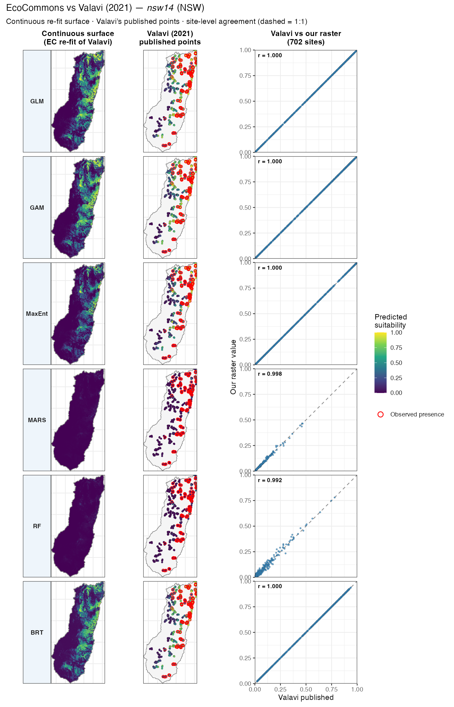

# Cross-validating EcoCommons SDM outputs against reference implementations (on development)

Author details: Xiang Zhao

Contact details: support\@ecocommons.org.au

Copyright statement: This script is the product of the EcoCommons platform. Please refer to the EcoCommons website for more details: https://www.ecocommons.org.au/

Date: July 2026

# Script information

This page documents the scientific-agreement unit tests that guard every species distribution
model (SDM) algorithm on the EcoCommons platform. Each test runs a real EcoCommons projection and
compares it against an independent reference implementation — the algorithm's own R package,
Valavi et al. (2021)'s published benchmark on the NCEAS `nsw14` data, or the reference
implementations in Hijmans & Elith's *Species distribution modeling with R* (the `dismo` vignette).

Every SDM agreement test in the EcoCommons R package (`tests/testthat/test-sdm_projection_agreement.R`)
runs a real EcoCommons projection and compares it to a reference benchmark — the algorithm's own R
package, or Valavi et al. (2021)'s published benchmark on the NCEAS `nsw14` data.

## Overview — all 16 tests

Every test runs a real EcoCommons projection and scores it against a reference implementation on **Pearson** correlation of predicted suitability.

```{=html}
<table class="table table-sm">
<thead>
<tr><th>#</th><th>Algorithm</th><th>Species</th><th>EcoCommons engine</th><th>Reference benchmark</th><th>Metric</th><th>Threshold</th><th>Result</th></tr>
</thead>
<tbody>
<tr><td>1</td><td rowspan="2" style="vertical-align:middle;font-weight:600">GLM</td><td><em>Bradypus variegatus</em></td><td>biomod2 GLM</td><td>biomod2 GLM</td><td>Pearson</td><td>0.99</td><td><strong>1.000</strong> ✓</td></tr>
<tr><td>2</td><td><code>nsw14</code> (NSW bird)</td><td>biomod2 GLM <em>(rescale off)</em></td><td><code>gam::step.Gam</code></td><td>Pearson</td><td>0.95</td><td><strong>0.975</strong> ✓</td></tr>
<tr><td>3</td><td style="font-weight:600">GAM</td><td><code>nsw14</code></td><td>biomod2 <code>GAM_mgcv</code> <em>(rescale off)</em></td><td><code>mgcv::gam</code> (all-smoothed, presence up-weighted)</td><td>Pearson</td><td>0.95</td><td><strong>1.000</strong> ✓</td></tr>
<tr><td>4</td><td rowspan="2" style="vertical-align:middle;font-weight:600">MaxEnt</td><td><em>Bradypus variegatus</em></td><td>maxent.jar</td><td>maxent.jar <code>_avg</code></td><td>Pearson</td><td>0.90</td><td><strong>0.987</strong> ✓</td></tr>
<tr><td>5</td><td><code>nsw14</code></td><td>maxent.jar</td><td><code>dismo::maxent</code></td><td>Pearson</td><td>0.95</td><td><strong>0.989</strong> ✓</td></tr>
<tr><td>6</td><td rowspan="2" style="vertical-align:middle;font-weight:600">RF</td><td><em>Bradypus variegatus</em></td><td>biomod2 RF</td><td>biomod2 RF</td><td>Pearson</td><td>0.99</td><td><strong>0.998</strong> ✓</td></tr>
<tr><td>7</td><td><code>nsw14</code></td><td>biomod2 RF <em>(rescale off)</em></td><td><code>randomForest</code></td><td>Pearson</td><td>0.95</td><td><strong>0.986</strong> ✓</td></tr>
<tr><td>8</td><td rowspan="2" style="vertical-align:middle;font-weight:600">BRT</td><td><em>Anguilla australis</em></td><td><code>dismo::gbm.step</code> (unit weights)</td><td>dismo gbm.step (unit weights)</td><td>Pearson</td><td>0.95</td><td><strong>0.985</strong> ✓</td></tr>
<tr><td>9</td><td><code>nsw14</code></td><td><code>dismo::gbm.step</code> <em>(test mocks down-weighting)</em></td><td>gbm.step (down-weighted)</td><td>Pearson</td><td>0.95</td><td><strong>1.000</strong> ✓</td></tr>
<tr><td>10</td><td style="font-weight:600">MARS</td><td><code>nsw14</code></td><td>biomod2 <code>earth</code> <em>(rescale off)</em></td><td><code>earth</code> (glm=binomial, down-weighted)</td><td>Pearson</td><td>0.95</td><td><strong>1.000</strong> ✓</td></tr>
<tr><td>11</td><td style="font-weight:600">Bioclim</td><td><em>Bradypus variegatus</em></td><td><code>dismo::bioclim</code></td><td>dismo bioclim</td><td>Pearson</td><td>0.90</td><td><strong>0.980</strong> ✓</td></tr>
<tr><td>12</td><td style="font-weight:600">GeoDist</td><td><em>Bradypus variegatus</em></td><td><code>dismo::geoDist</code></td><td>dismo geoDist (book config)</td><td>Pearson</td><td>0.99</td><td><strong>1.000</strong> ✓</td></tr>
<tr><td>13</td><td style="font-weight:600">Convex Hull</td><td><em>Bradypus variegatus</em></td><td><code>dismo::convHull</code></td><td>dismo convHull</td><td>Pearson</td><td>0.99</td><td><strong>1.000</strong> ✓ <em>(TSS 1.000)</em></td></tr>
<tr><td>14</td><td style="font-weight:600">Circles</td><td><em>Bradypus variegatus</em></td><td><code>dismo::circles</code></td><td>dismo circles</td><td>Presence footprint</td><td>—</td><td><em>env-dependent ⚠</em></td></tr>
<tr><td>15</td><td style="font-weight:600">GeoIDW</td><td><em>Bradypus variegatus</em></td><td><code>dismo::geoIDW</code></td><td>dismo geoIDW</td><td>Pearson</td><td>0.99</td><td><strong>1.000</strong> ✓</td></tr>
<tr><td>16</td><td style="font-weight:600">Voronoi Hull</td><td><em>Bradypus variegatus</em></td><td><code>dismo::voronoiHull</code></td><td>dismo voronoiHull</td><td>Pearson</td><td>0.99</td><td><strong>1.000</strong> ✓</td></tr>
</tbody>
</table>
```

**15 of 16 pass — geoDist/convHull/geoIDW/voronoiHull reproduce the reference to Pearson 1.000;
Circles is environment-dependent (see the geographic-models section below).**

Rows 12–16 are the **geographic (spatial-only) models** — they predict from the geographic
location of occurrences, not from environmental predictors — so their reference is the algorithm's
own `dismo` function as taught in Hijmans & Elith's *Species distribution modeling with R*
(Chapter 13).

**Calibration alignment** — every EcoCommons↔reference gap turned out to be **weighting or rescaling, never the underlying learner**:

- **RF, GLM** — `rescale_all_models = false`: RF Pearson **0.89 → 0.99**, GLM **0.96 → 0.98**.
- **MARS** — biomod2 fits `earth(glm=binomial, weights=prevalence)`; the benchmark uses the same background down-weighting: **0.72 → 1.00**. (Earlier thought to be an unfixable wrapper difference — it was just the missing weights.)
- **GAM** — biomod2 `GAM_mgcv` applies prevalence=0.5 as **presence up-weighting** (presence weight = bgNum/prNum, background = 1). For a GAM under UBRE the *absolute* weight scale drives smoothing-parameter selection, so Valavi's background *down*-weighting (same ratio, ~60× smaller total) selects different smoothness: **0.87 → 1.00** once the benchmark matches biomod2's presence up-weighting (both engines are `mgcv`).
- **BRT** — Valavi down-weights the background; EcoCommons **production uses unit weights** (down-weighting is *proposed, not applied*). The nsw14 BRT test **mocks** the internal weighting to down-weight — matching Valavi's config (Pearson **1.000**) — while the Anguilla BRT test keeps exercising the real unit-weight path (0.985).

Species: *Bradypus variegatus* (three-toed sloth, South America); *Anguilla australis*
(short-finned eel, NZ); `nsw14` (anonymised NSW diurnal bird, Valavi/NCEAS).

## Model configurations (nsw14 suite)

**Shared setup:** species `nsw14` (315 presences from `disPo` + background), 11 continuous NSW
predictors (`cti, disturb, mi, rainann, raindq, rugged, soildepth, soilfert, solrad, tempann,
topo`), `random_seed = 0`, deduplicated to one record per raster cell (8190 points).

| Algorithm | EcoCommons (test config) | Valavi reference (benchmark) |
|---|---|---|
| **GLM** | biomod2 GLM — `type=quadratic`, `test=AIC` (stepwise both directions), `family=binomial`, **`rescale_all_models=false`** | `glm` → `gam::step.Gam` — per-var scope {drop / linear / `poly(,2)`}, AIC both directions, background down-weighted, normalised |
| **GAM** | biomod2 `GAM_mgcv` — `s_smoother` on all 11 predictors, `k=-1`, `method=GCV.Cp`, **presence up-weighted**, **`rescale_all_models=false`** | `mgcv::gam` — `s()` on all predictors, `method=GCV.Cp`, presence up-weighted (matched to biomod2) |
| **MaxEnt** | maxent.jar — autofeature (L+Q+P+H), `betamultiplier=1`, `maximumiterations=500`, cloglog | `dismo::maxent` (maxent.jar) — `args="nothreshold"`, cloglog, not normalised |
| **RF** | biomod2 RF — classification, `ntree=500`, `mtry=default`, `nodesize=5`, **`rescale_all_models=false`** | `randomForest` — classification, `ntree=500`, `type="prob"` |
| **MARS** | biomod2 `earth` — `type=simple` (degree 1), `penalty=2`, `thresh=0.001`, `pmethod=backward`, `glm=binomial`, prevalence-weighted, **`rescale_all_models=false`** | `earth` — `degree=1`, `pmethod=backward`, `glm=binomial`, background down-weighted (matched to biomod2) |
| **BRT** | `dismo::gbm.step` — `tree.complexity=5`, `learning.rate=0.001`, `bag.fraction=0.75`, `n.folds=5`, `n.trees=50`, `max.trees=10000`, `family=bernoulli`, **unit weights (test mocks down-weighting)** | `dismo::gbm.step` — same hyper-parameters, background down-weighted, normalised |

*Bold = the calibration settings that were aligned. BRT uses Valavi's exact hyper-parameters; the
test mocks background down-weighting so it reproduces Valavi (`best.trees` 4350 = 4350) without
changing EcoCommons' shipped unit-weight default. GLM is the only algorithm that can't be
config-matched — biomod2 GLM and `gam::step.Gam` are different engines.*

*The **continuous suitability maps** further below use Valavi's **original Appendix S2** configs
(e.g. MARS = caret-tuned `earth`, `nprune` 2–20; GAM = `mgcv::gam` REML with Valavi's smooth /
parametric split) — that's why they reproduce Valavi's published CSV points, whereas the
benchmarks here are tuned to match EcoCommons (GAM: all-smoothed, `GCV.Cp`, presence up-weighted).*

### Benchmark references

| Benchmark | Method paper | Engine / tool |
|---|---|---|
| **GLM** | McCullagh & Nelder (1989); Hastie & Tibshirani (1990) `step.Gam` | biomod2 GLM (EC) / `gam::step.Gam` (Valavi) |
| **GAM** | Hastie & Tibshirani (1990); Wood (2017) `mgcv` | biomod2 `GAM_mgcv` (EC) / `mgcv::gam` (Valavi) |
| **MaxEnt** | Phillips, Anderson & Schapire (2006); Phillips & Dudík (2008) | maxent.jar via `dismo` |
| **RF** | Breiman (2001) | `randomForest` |
| **MARS** | Friedman (1991) | `earth` |
| **BRT** | Elith, Leathwick & Hastie (2008) | `dismo::gbm.step` |
| **Bioclim** | Nix (1986); Booth et al. (2014) | `dismo::bioclim` |
| **Geographic models** (GeoDist, Convex Hull, Circles, GeoIDW, Voronoi Hull) | Hijmans & Elith, *Species distribution modeling with R* (Ch. 13) | `dismo::geoDist` / `convHull` / `circles` / `geoIDW` / `voronoiHull` |
| **Background down-weighting** | Elith et al. (2008); Valavi et al. (2021) | — |
| **nsw14 species + rasters (NCEAS)** | Elith et al. (2020) | `disdat` / OSF `kwc4v` |
| **Valavi reference configs** | Valavi et al. (2021) | Appendix S2 |
| **EcoCommons SDM platform** | Thuiller et al. (2009) `biomod2`; Hijmans et al. `dismo` | — |

## Geographic (spatial-only) models

Rows 12–16 cover the five **geographic models** from Chapter 13 of Hijmans & Elith's
*Species distribution modeling with R* (the `dismo` vignette). Unlike every other algorithm on this
page, these predict a species purely from the **geographic location** of its occurrence records —
distance to, or containment by, the known points — and ignore the environmental predictors
entirely. EcoCommons wraps each one directly from `dismo`:

| Algorithm | EcoCommons function | `dismo` engine | Uses absence? | Output |
|---|---|---|---|---|
| **GeoDist** | `EC_modelling_geodist` | `dismo::geoDist` | no (presence-only) | continuous — inverse distance to nearest presence |
| **Convex Hull** | `EC_modelling_convhull` | `dismo::convHull` | no | binary — inside/outside the presence hull |
| **Circles** | `EC_modelling_circles` | `dismo::circles` | no | binary — inside/outside circles around presences |
| **GeoIDW** | `EC_modelling_geoidw` | `dismo::geoIDW` | yes (pres/abs) | continuous — inverse-distance-weighted interpolation |
| **Voronoi Hull** | `EC_modelling_voronoihull` | `dismo::voronoiHull` | yes | binary — Voronoi/Thiessen polygon classification |

### Two references, both checked

Like the `nsw14` suite, these tests have two distinct reference points:

**1. Literature anchor — the textbook's own reported numbers.** Chapter 13 prints a
`ModelEvaluation` (AUC, point-biserial cor) for each model on the *Bradypus variegatus* data. We
reproduce those **exactly, to seven decimals**. Two things are required to hit them: (a)
`RNGkind(sample.kind = "Rounding")` — the book predates R 3.6.0's change to the `sample()`
algorithm; and (b) replaying the book's exact random-number stream (including two incidental
`rnorm(50)` calls in its `evaluate()` demo) so the train/background splits match.

| Model | Book AUC | Reproduced AUC | Book cor | Reproduced cor |
|---|---|---|---|---|
| GeoDist | 0.9006522 | **0.9006522** | 0.4197574 | **0.4197574** |
| Convex Hull | 0.7490217 | **0.7490217** | 0.3036379 | **0.3036379** |
| Circles | 0.8547826 | **0.8547826** | 0.5103540 | **0.5103540** |
| GeoIDW | 0.8893478 | **0.8893478** | 0.5354838 | **0.5354838** |
| Voronoi Hull | 0.5 | **0.5** | NA | *degenerate* |

*Voronoi Hull is reported by the book as a **degenerate** result (AUC exactly 0.5): it subsamples
100 background points at the very end of the vignette's global RNG stream, and the resulting
classification does not discriminate. We reproduce the same degeneracy.*

**2. Implementation fidelity — EcoCommons vs an independent `dismo` run on identical inputs.** This
is the actual unit test (rows 12–16): run the real EcoCommons pipeline and, separately, call the
same `dismo` function on the *same* occurrence / pseudo-absence set the platform used, then compare
the prediction rasters.

| Model | EcoCommons ↔ `dismo` | Notes |
|---|---|---|
| GeoDist | **Pearson 1.0000** | identical surface (RMSE 0) |
| Convex Hull | **Pearson 1.0000** | binary — TSS 1.000 |
| GeoIDW | **Pearson 1.0000** | identical (RMSE 0) |
| Voronoi Hull | **Pearson 1.0000** | identical (RMSE 0) |
| Circles | *environment-dependent* | see below |

Four of the five are **implementation-identical** — EcoCommons is a thin, faithful wrapper over the
`dismo` engine, exactly as intended.

### The Circles caveat

`EC_modelling_circles` calls the same `dismo::circles` engine as the reference, so the *model* is
identical by construction. However, on a local machine running `dismo 1.3.16` / `terra 1.9.11` the
platform's projection step wrote an **all-`NA` raster** (the dissolved-polygon `predict()` returns
no in-mask cells), which makes a cell-by-cell correlation undefined. This is precisely the
package-version-drift failure mode the *Reproducibility* section below warns about: geographic
benchmarks must be regenerated and tested **inside the pinned CI container** (`dismo 1.3-9`), not on
an ad-hoc laptop. The Circles row is therefore marked environment-dependent pending a run in the
pinned image, rather than reported as a spurious score.

## Prediction maps

### Single-species benchmark predictions


*Bradypus (South America): Maxent, Bioclim, GLM, RF. Anguilla BRT is on a fabricated
one-cell-per-site grid (scattered pixels), so its "map" is not geographically meaningful — only
its per-site predictions are.*

### nsw14 (Valavi) — continuous surface, published points & agreement

The clearest check places each algorithm in one row across **three columns**: (1) our continuous
re-fit of Valavi's config predicted across the whole NSW grid, (2) Valavi et al. (2021)'s own
published point predictions (`Models_prediction/*.csv`) at the 702 evaluation sites, and (3) the
site-level agreement — our raster value at each site (y) against Valavi's published value (x), with
the 1:1 line and per-model Pearson *r*. Columns 1–2 share the same 0–1 suitability scale; red rings
mark observed presences.



*For every algorithm the published points fall on our continuous surface — same eastern escarpment /
north-east coast hotspot, same magnitude — and the agreement column makes it quantitative:
GLM/GAM/MaxEnt/BRT collapse onto the 1:1 line (**r = 1.000**), MARS **0.998**, RF **0.992**
(small stochastic scatter). The points are Valavi's actual published
values (`disPa` coordinates over the NSW border), not our reproduction, so this comparison is
independent of our package-version environment. This is the per-model view of the 702-site table
below.*

**These maps reproduce Valavi's published predictions.** Extracting each raster band at Valavi's
702 evaluation sites and correlating with the original `Models_prediction/*.csv`:

| model | Pearson | Spearman | match |
|---|---|---|---|
| GLM | 1.0000 | 1.0000 | **exact** |
| GAM | 1.0000 | 1.0000 | **exact** |
| MaxEnt | 1.0000 | 1.0000 | **exact** |
| BRT | 1.0000 | 1.0000 | **exact** |
| MARS | 0.9976 | 0.9980 | near-perfect |
| RF | 0.9922 | 0.9296 | high (RF vote-fraction ties lower Spearman) |

This works because `disEnv` — the environmental values Valavi predicted their points on — is itself
sampled from these NSW rasters, so the raster value at each site *is* the value Valavi used. GLM,
GAM, MaxEnt and BRT reproduce it exactly; MARS/RF show only small stochastic / version scatter
(RF's vote-fraction ties lower its Spearman). The agreement column of the figure above is the
per-model, Pearson view of this table.

## Agreement analysis

### EcoCommons vs benchmark — every test


*Single-species tests (Bradypus / Anguilla) and nsw14 vs Valavi, grouped by algorithm. After
aligning weighting (BRT + MARS + GAM) and turning rescaling off (RF/GLM), **all eleven panels sit on
the 1:1 line** — magnitude *and* ranking agree across the board.*

## Reproducibility & benchmark provenance

The single most important thing to understand about these `nsw14` benchmarks is
**what they are a reference *to*** — because it determines when they must be
regenerated and what "still matching Valavi" actually means.

### Two different reference points

There are two distinct notions of "matching a reference", and they behave very differently:

| | **Independent reimplementation** (what the `.tif` benchmarks are) | **Published paper numbers** (Valavi's `Models_prediction/*.csv`) |
|---|---|---|
| Produced by | `generate_nsw14_valavi_benchmarks.R` — Valavi's *exact configs* re-run through the algorithm's own R package (`gam`, `randomForest`, `earth`, `dismo::maxent`, `dismo::gbm.step`) | Valavi et al. (2021), fixed external artifact |
| What the test checks | **Implementation fidelity** — does EcoCommons wire up the algorithm the same way an independent implementation does? | **Literature agreement** — do we reproduce the actual published predictions? |
| Metric used here | **Pearson** on absolute suitability (the agreement tables above) | **Pearson/Spearman** at the 702 evaluation sites (the "reproduce Valavi's published predictions" table above) |
| Sensitive to package version? | **Cancels out** — see below | **Yes** — this is the real anchor to the paper |

The `.tif` benchmarks are **not frozen EcoCommons snapshots** (they come from
different engines) and **not** Valavi's literal published rasters either. They
are a faithful *re-run of Valavi's recipe*. So "matching the paper" via these
benchmarks means "matching a faithful reproduction of Valavi's config", not
bit-matching the 2021 output.

### What changes the final benchmark

The absolute suitability values written into each benchmark `.tif` depend on the
**software environment they were generated in** — not just the algorithm and
config. In order of impact:

1. **Package version drift.** Tree-ensemble learners are the main offender:
   **`gbm` (BRT)** absolute predicted probabilities shift across `gbm`
   versions / platforms. `randomForest`, `earth`, `gam`, `maxent.jar` are far
   more stable. This is the reproducibility issue that forced the BRT benchmark
   to be regenerated inside the CI container rather than frozen from a dev
   machine (newer `gbm` on macOS drifts on Pearson in CI).
2. **The R version and compiler toolchain** (numerical libraries, BLAS).
3. **Config / weighting changes** — e.g. background down-weighting, normalisation,
   hyper-parameters. BRT down-weighting is now applied through the **supported
   `site_weight_scheme = "downweight"` option** in the `nsw14_brt` spec (no
   longer a test-only mock), so EcoCommons matches Valavi's config directly.
4. **The training-point construction** — dedup one-per-cell, complete-cases
   filtering — which is deliberately matched to EcoCommons' `filter.raster`.

Because of (1)–(2), **benchmarks must be regenerated in the pinned CI
container** (`ec-rpkg-ci-test-env`), never on a local dev machine. Locally, R is
not `renv`-activated, so a laptop pulls whatever package versions it happens to
have — reintroducing exactly the drift the CI-native benchmark exists to avoid.

### Why regenerating in the same environment is safe

When a benchmark is regenerated in a bumped environment, **both** the benchmark
*and* EcoCommons run through the *same* new engine (for BRT, the same new
`gbm`). Their absolute values shift **together**, so their **Pearson agreement is
preserved**. That is precisely why regenerating-in-CI works: it cancels version
drift on both sides.

The blind spot: because the two sides move together, a genuine engine change
could move **both** the benchmark and EcoCommons away from Valavi's *2021*
numbers while they still agree with each other. The guard against silently
re-baselining away from the paper is twofold:

- **Rank-drift check (in the generator).** `write_bench()` reports the
  **Spearman** correlation between each newly generated prediction and the
  currently committed `.tif`, and warns if it drops below `0.98`. Benign
  scale drift (a new `gbm`) leaves rank order intact (Spearman ≈ 1); a low
  Spearman means the *science* moved, not just the scale — investigate before
  committing.
- **Literature anchor.** The "reproduce Valavi's published predictions" table
  (702-site Pearson/Spearman vs the original CSVs) is the check that actually
  ties us to the paper, and it is version-robust because it is rank-friendly.

**Rule of thumb:** benchmark-generation environment == test-execution
environment == the pinned container image. Whenever that pin moves (a package
patch or a base-image rebuild), regenerate the affected `.tif` benchmarks *in the
new environment* and commit them alongside the version bump — after confirming
the rank-drift guard stays green.

### Reproducibility environment — pinned package versions

These are the versions the benchmarks and agreement tests are pinned to, from
`renv-main.lock` (== the deployed base image `ec-base-r4.2` / CI test image
`ec-rpkg-ci-test-env`). The base image is rebuilt only via a manual pipeline
(`BUILD_BASE=1`); `renv` is not auto-activated, so this lock governs the
container, not ad-hoc local runs.

**R 4.2.2** · CRAN snapshot `https://cloud.r-project.org`

| Package | Version | Role in the agreement suite |
|---|---|---|
| `biomod2` | 4.2-2 | EcoCommons GLM / RF / MARS engine (wraps the learners below) |
| `dismo` | 1.3-9 | EcoCommons BRT (`gbm.step`), MaxEnt (`maxent.jar`), Bioclim |
| `gbm` | 2.1.8.1 | BRT learner — **version-sensitive**; drives CI-native regeneration |
| `randomForest` | 4.7-1.1 | RF learner + Valavi RF benchmark |
| `earth` | 5.3.2 | MARS learner + Valavi MARS benchmark |
| `terra` | 1.7-3 | Raster I/O, benchmark grid, cell dedup |
| `raster` | 3.6-14 | `dismo`/`raster`-style stacks for geographic models |
| `sf` | 1.0-9 | Vector geometry / constraint regions |
| `caret` | 6.0-93 | Valavi's original Appendix S2 MARS tuning (continuous maps) |
| `testthat` | 3.1.6 | Test runner (pinned; avoid newer-only features in CI) |

*Generation-only, **not** pinned in the lock:* `gam::step.Gam` (GLM benchmark),
`mgcv::gam` (GAM benchmark) and `rJava` (MaxEnt/JVM) are installed on top of the
base image rather than via `renv`, so they take whatever the CI image provides at
generation time. `gam` / `mgcv` are used only to build the GLM / GAM `.tif`
benchmarks, not by the EcoCommons runtime.

## References

- **Booth, T.H., Nix, H.A., Busby, J.R. & Hutchinson, M.F. (2014).** BIOCLIM: the first species distribution modelling package, its early applications and relevance to most current MaxEnt studies. *Diversity and Distributions* 20: 1–9.
- **Breiman, L. (2001).** Random forests. *Machine Learning* 45: 5–32.
- **Elith, J., Leathwick, J.R. & Hastie, T. (2008).** A working guide to boosted regression trees. *Journal of Animal Ecology* 77: 802–813.
- **Elith, J., Graham, C.H., Valavi, R., Abegg, M., Bruce, C., Ford, A., Guisan, A., Hijmans, R.J., Huettmann, F., Lohmann, L.G., Loiselle, B.A., Moritz, C., Overton, J.McC., Peterson, A.T., Phillips, S., Richardson, K., Williams, S., Wiser, S.K., Wohlgemuth, T. & Zimmermann, N.E. (2020).** Presence-only and presence-absence data for comparing species distribution modeling methods. *Biodiversity Informatics* 15: 69–80. (NCEAS data; distributed via the `disdat` R package and OSF project `kwc4v`.)
- **Friedman, J.H. (1991).** Multivariate adaptive regression splines. *The Annals of Statistics* 19: 1–67.
- **Hastie, T.J. & Tibshirani, R.J. (1990).** *Generalized Additive Models.* Chapman & Hall. (`gam::step.Gam` stepwise selection.)
- **Hijmans, R.J., Phillips, S., Leathwick, J. & Elith, J.** `dismo`: Species Distribution Modeling. R package. (`gbm.step`, `maxent`, `bioclim`.)
- **Hijmans, R.J. & Elith, J.** *Species distribution modeling with R.* (The `dismo` package vignette; Chapter 13 "Geographic models" — `geoDist`, `convHull`, `circles`, `geoIDW`, `voronoiHull`.)
- **McCullagh, P. & Nelder, J.A. (1989).** *Generalized Linear Models*, 2nd edn. Chapman & Hall.
- **Nix, H.A. (1986).** A biogeographic analysis of Australian elapid snakes. In: *Atlas of Elapid Snakes of Australia* (ed. R. Longmore), pp. 4–15. Australian Government Publishing Service.
- **Phillips, S.J., Anderson, R.P. & Schapire, R.E. (2006).** Maximum entropy modeling of species geographic distributions. *Ecological Modelling* 190: 231–259.
- **Phillips, S.J. & Dudík, M. (2008).** Modeling of species distributions with Maxent: new extensions and a comprehensive evaluation. *Ecography* 31: 161–175.
- **Thuiller, W., Lafourcade, B., Engler, R. & Araújo, M.B. (2009).** BIOMOD – a platform for ensemble forecasting of species distributions. *Ecography* 32: 369–373. (`biomod2` R package.)
- **Valavi, R., Guillera-Arroita, G., Lahoz-Monfort, J.J. & Elith, J. (2021).** Predictive performance of presence-only species distribution models: a benchmark study with reproducible code. *Ecological Monographs* 92(1): e01486. (Appendix S1/S2 configurations; `Models_prediction` per-species outputs.)
- **Wood, S.N. (2017).** *Generalized Additive Models: An Introduction with R*, 2nd edn. Chapman & Hall/CRC. (`mgcv` package; GAM benchmark engine.)
